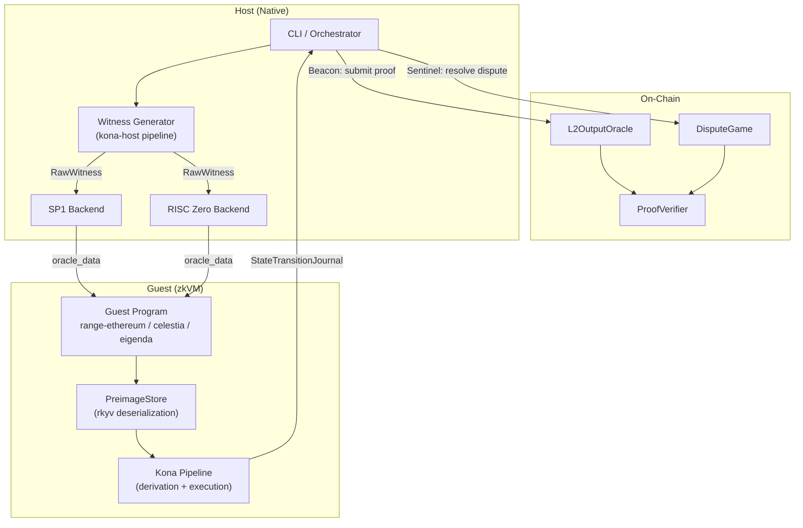
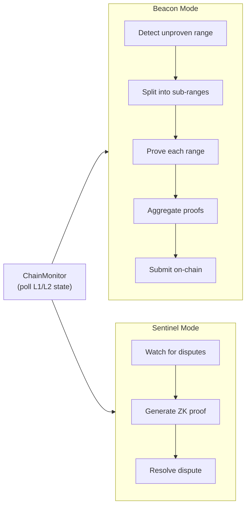
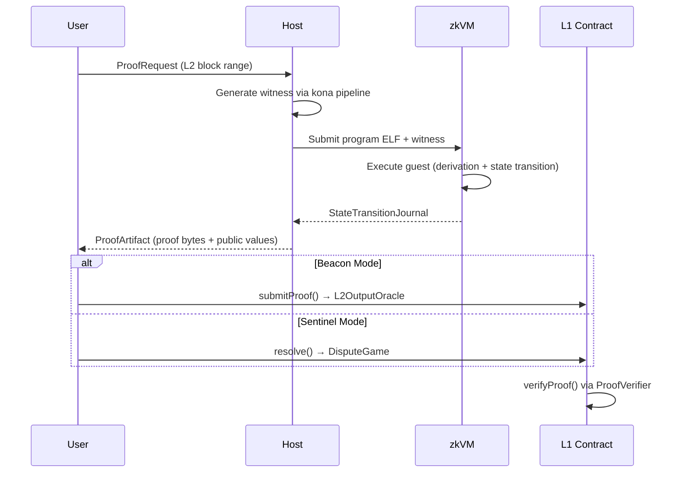

# open-zk

**Unified ZK proving SDK for OP Stack rollups**

[](https://github.com/arkios-labs/open-zk/actions/workflows/ci.yml)
[](LICENSE)
[](https://www.rust-lang.org/)

## Overview

open-zk is a backend-agnostic ZK proving SDK for OP Stack L2 state transitions. It provides a unified interface for generating ZK proofs across multiple zkVM backends, enabling rollup operators to choose the most cost-effective proving strategy without rewriting their proving infrastructure.

The project unifies approaches from two leading OP Stack ZK implementations:

- **[OP Succinct](https://github.com/succinctlabs/op-succinct)** (Succinct Labs) — SP1-based proving for OP Stack
- **[Kailua](https://github.com/boundless-xyz/kailua)** (Boundless/RISC Zero) — RISC Zero-based proving for OP Stack

Both use RISC-V ISA-based zkVMs, enabling a shared architecture where the zkVM backend can be swapped while keeping the derivation pipeline, witness generation, and contract verification intact.

> **Status**: Early development (v0.1.0). Core proving pipeline is functional with SP1 and RISC Zero backends.

## How Rollups Use open-zk

OP Stack rollups traditionally rely on a 7-day challenge window (optimistic fault proofs) to achieve finality. open-zk replaces or augments this with ZK proofs, offering two operating modes:

### Beacon Mode — Validity Proofs (Full ZK Rollup)

Every L2 output root submission is accompanied by a ZK proof. The on-chain `L2OutputOracle` contract only accepts state transitions with a valid proof, providing **instant finality** without any challenge period.

```
L2 blocks produced → Witness generated → ZK proof created → Proof submitted on-chain → Instant finality
```

Best for rollups that prioritize fast finality and can absorb proving costs.

### Sentinel Mode — ZK-Backed Fault Proofs (Hybrid)

Output roots are submitted optimistically (without proofs). A `DisputeGame` contract allows anyone to challenge a suspicious output root. When a dispute is raised, the sentinel automatically generates a ZK proof to resolve it — proving the correct state transition on-chain.

```
L2 blocks produced → Output root submitted (no proof) → Dispute raised? → ZK proof resolves dispute
```

Best for rollups that want lower operating costs while maintaining ZK-grade security as a fallback. The challenge timeout is configurable (default: 1 hour with ZK vs. 7 days with traditional fault proofs).

### Quick Start for Rollup Operators

#### 1. Initialize Configuration

```bash
open-zk init                        # Creates open-zk.toml with defaults
open-zk init -o my-rollup.toml      # Custom path
```

#### 2. Configure `open-zk.toml`

```toml
[network]
l1_rpc_url = "https://eth-mainnet.g.alchemy.com/v2/YOUR_KEY"
l2_rpc_url = "https://your-rollup.rpc.endpoint"
l1_beacon_url = "https://your-beacon-node:5052"

[proving]
backend = "sp1"                 # "sp1" | "risc0" | "mock"
mode = "beacon"                 # "beacon" (validity) | "sentinel" (fault proof)
security = "standard"           # "maximum" | "standard" | "economy"
target_finality_secs = 1800     # Target finality time in seconds
max_cost_per_proof = 1.0        # Max cost per proof in USD
max_concurrent_proofs = 4       # Parallel proof jobs
```

**Configuration Reference:**

| Field | Values | Default | Description |
|-------|--------|---------|-------------|
| `backend` | `sp1`, `risc0`, `mock` | `sp1` | zkVM backend to use |
| `mode` | `beacon`, `sentinel` | `beacon` | Proof mode (validity vs fault proof) |
| `security` | `maximum`, `standard`, `economy` | `standard` | Security / cost trade-off level |
| `target_finality_secs` | seconds | `1800` | Target finality time |
| `max_cost_per_proof` | USD | `1.0` | Cost constraint per proof |
| `max_concurrent_proofs` | integer | `4` | Max parallel proof generation jobs |

**How the Intent Resolver maps your config to concrete parameters:**

| Security | Proof Mode | Backend | Aggregation Window |
|----------|------------|---------|-------------------|
| `maximum` | Beacon (always) | SP1 | 10 blocks |
| `standard` + finality ≤ 30min + budget ≥ $0.50 | Beacon | SP1 | 100 blocks |
| `standard` + finality ≤ 30min + budget < $0.50 | Beacon | RISC Zero | 100 blocks |
| `standard` + finality > 1hr | Sentinel | RISC Zero | 100 blocks |
| `economy` | Sentinel (always) | RISC Zero | 1000 blocks |

#### 3. Deploy On-Chain Contracts

```bash
# Beacon mode — deploy L2OutputOracle + ProofVerifier
open-zk fast-track \
  --deployer-key <PRIVATE_KEY> \
  --owner-key <OWNER_KEY> \
  --starting-block 0 \
  --submission-interval 20

# Sentinel mode — additionally deploy DisputeGame
open-zk fast-track \
  --deployer-key <PRIVATE_KEY> \
  --owner-key <OWNER_KEY> \
  --with-dispute-game \
  --challenge-timeout 3600
```

**Deployment flags:**

| Flag | Default | Description |
|------|---------|-------------|
| `--l1-rpc-url` | `http://127.0.0.1:8545` | L1 RPC endpoint |
| `--l2-rpc-url` | `http://127.0.0.1:9545` | L2 RPC endpoint |
| `--l1-beacon-url` | `http://127.0.0.1:5052` | L1 Beacon API endpoint |
| `--deployer-key` | (required) | Private key for contract deployment |
| `--owner-key` | (required) | Private key for contract ownership |
| `--starting-block` | `0` | L2 block number to start proving from |
| `--submission-interval` | `20` | Number of L2 blocks between submissions |
| `--with-dispute-game` | `false` | Deploy DisputeGame contract (Sentinel mode) |
| `--challenge-timeout` | `3600` | Dispute challenge window in seconds |

Deployment outputs a `deployment.json` with contract addresses — reference these in your `open-zk.toml`.

#### 4. Run the Proving Service

```bash
# One-shot proof for a specific block range
open-zk prove --start-block 100 --end-block 200

# Estimate cost before proving
open-zk estimate --start-block 100 --end-block 200

# Run as a long-lived service (continuous proving loop)
open-zk serve --poll-interval 12

# Check current proving status
open-zk status
```

**CLI Commands:**

| Command | Description |
|---------|-------------|
| `open-zk init` | Generate default `open-zk.toml` config file |
| `open-zk prove` | Generate a proof for a specific L2 block range |
| `open-zk estimate` | Estimate proving cost for a block range |
| `open-zk serve` | Run the orchestration engine as a continuous service |
| `open-zk status` | Check L1/L2 chain state and proving progress |
| `open-zk fast-track` | Deploy on-chain contracts (devnet / testnet) |

#### 5. On-Chain Contracts

| Contract | Role |
|----------|------|
| `IProofVerifier` | Verifies zkVM proofs (SP1 / RISC Zero) against a program verification key |
| `IOpenZkL2OutputOracle` | Accepts proven L2 state transitions, tracks latest proven block |
| `IOpenZkDisputeGame` | Manages disputes: `challenge()` to dispute, `resolve()` with a ZK proof |

## Architecture



The host generates witness data by running kona's derivation pipeline against L1/L2 nodes, serializes it via rkyv, and passes it to a guest program running inside a zkVM. The guest deserializes the preimage data, re-executes the derivation and state transition, and commits a `StateTransitionJournal` that can be verified on-chain.

### Orchestration Engine

The `OrchestrationEngine` drives the proving loop based on the selected mode:



## Workspace Structure

| Crate | Path | Description |
|-------|------|-------------|
| `open-zk` | `sdk/` | Unified SDK re-exporting core functionality |
| `open-zk-core` | `core/` | Core traits and types (`no_std` compatible) |
| `open-zk-guest` | `guest/` | Guest-side I/O abstraction for zkVM programs |
| `open-zk-host` | `host/` | Host prover backends and witness generation |
| `open-zk-orchestrator` | `orchestrator/` | Orchestration engine (Beacon / Sentinel loops) |
| `open-zk-contracts` | `onchain/` | On-chain contract ABIs (Verifier, Oracle, DisputeGame) |
| `open-zk-cli` | `cli/` | CLI tool (`prove`, `serve`, `fast-track`, etc.) |
| `open-zk-sp1` | `zkvm/sp1/host/` | SP1 prover backend, ELF loading, witness adapter |
| `open-zk-risc0` | `zkvm/risc0/host/` | RISC Zero prover backend, ELF builder, witness adapter |

**Guest Programs** (compiled separately, not workspace members):

| Program | Path | Description |
|---------|------|-------------|
| `guest-range-ethereum` | `guests/range-ethereum` | Range proof with Ethereum DA |
| `guest-range-celestia` | `guests/range-celestia` | Range proof with Celestia DA |
| `guest-range-eigenda` | `guests/range-eigenda` | Range proof with EigenDA |
| `guest-aggregation` | `guests/aggregation` | Aggregates multiple range proofs |

## Getting Started

### Prerequisites

- **Rust** (edition 2021)
- **[just](https://github.com/casey/just)** — task runner
- **Docker** — for devnet
- **SP1 toolchain** (optional):
  ```bash
  curl -L https://sp1.succinct.xyz | bash && sp1up
  ```
- **RISC Zero toolchain** (optional):
  ```bash
  curl -L https://risczero.com/install | bash && rzup install
  ```

### Build & Test

```bash
# Build the workspace
cargo build

# Run all tests
cargo test --workspace

# Lint and format check
just ci
```

### Build Guest ELFs

```bash
# SP1 guests
just guest-build

# RISC Zero guest (via risc0-build)
cargo build -p open-zk-risc0 --features rebuild-guest,debug-guest-build
```

## Proving Flow



1. The **host** receives a `ProofRequest` specifying an L2 block range to prove
2. The **witness generator** runs kona's host pipeline to fetch all required L1/L2 data and serializes it as `RawWitness`
3. The witness is adapted to the target backend format and submitted alongside the guest ELF
4. The **guest program** deserializes preimages, re-derives L2 blocks from L1 data, executes state transitions, and commits the resulting output root
5. The **host** receives a `ProofArtifact` containing the proof and public values
6. The proof is submitted on-chain — either directly to `L2OutputOracle` (Beacon) or to `DisputeGame` (Sentinel)

## Key Concepts

| Concept | Description |
|---------|-------------|
| `ProverBackend` | Backend-agnostic trait: `prove()`, `verify()`, `estimate_cost()` |
| `WitnessProvider` | Fetches L1/L2 data and generates `RawWitness` |
| `PreimageStore` | rkyv-backed preimage oracle serving kona's derivation pipeline in the guest |
| `ProvingMode` | `Execute` (no proof), `Compressed`, `Groth16` (on-chain verifiable) |
| `ProofMode` | `Beacon` (validity proofs) or `Sentinel` (ZK-backed fault proofs) |
| `StateTransitionJournal` | Guest output: `l1_head`, `l2_pre_root`, `l2_post_root`, `l2_block_number` |
| `ChainMonitor` | Polls L1/L2 state, detects unproven ranges and active disputes |
| `DisputeGame` | On-chain contract: `challenge()` to dispute, `resolve()` with ZK proof |

## Devnet

A local OP Stack devnet is provided for integration testing:

```bash
just devnet-fetch   # Clone Optimism monorepo (v1.9.1)
just devnet-up      # Start L1 + L2 + Beacon + OP Node
just test-devnet    # Run integration tests against devnet
just devnet-down    # Stop all containers
```

| Service | Endpoint |
|---------|----------|
| L1 RPC | `http://127.0.0.1:8545` |
| L2 RPC | `http://127.0.0.1:9545` |
| L1 Beacon | `http://127.0.0.1:5052` |
| OP Node RPC | `http://127.0.0.1:7545` |

## Contributing

See [CONTRIBUTING.md](CONTRIBUTING.md) for development setup, CI details, and contribution guidelines.

## License

Licensed under either of:

- [MIT License](http://opensource.org/licenses/MIT)
- [Apache License, Version 2.0](http://www.apache.org/licenses/LICENSE-2.0)

at your option.
